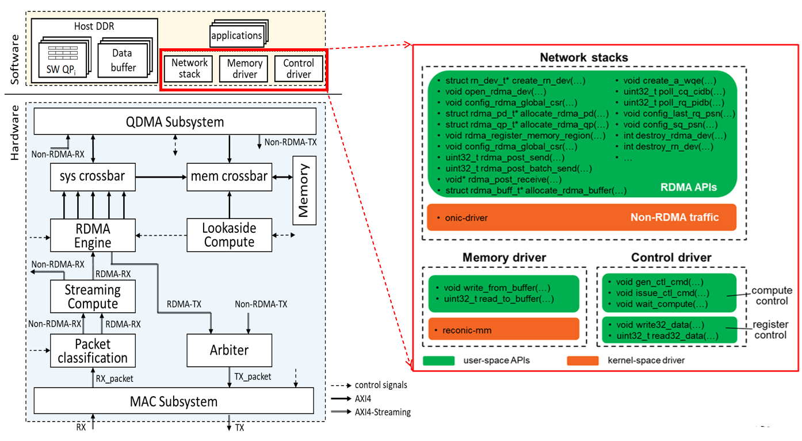

# RecoNIC - <ins>R</ins>DMA-<ins>e</ins>nabled <ins>C</ins>ompute <ins>O</ins>ffloading on Smart<ins>NIC</ins>

To meet the explosive growth of data and scale-out workloads/applications, today's data centers comprise sea of network connected hosts, each with multi-core CPUs and accelerators in the form of ASICs, FPGAs, and/or GPUs. The interaction between these hosts takes place through network interface cards (NICs) operating at speeds of 40Gbps or higher. Such data center architecture provides an ideal environment for distributed applications. When computation tasks are offloaded to accelerators, data received from remote application components through the network is first stored in the host’s memory and then copied to the memory of accelerators via the PCIe bus. Once computation tasks are completed, results destined for remote peers are often copied back to the host’s memory. This CPU-centric solution introduces multiple data copies, leading to a notable decrease in overall performance and increased latency.

To address these challenges, we propose RecoNIC, an RDMA-enabled SmartNIC platform with compute acceleration, designed to minimize the overhead associated with data copies and to bring data as close to computation as feasible. The platform consists of a hardware shell and software stacks. The hardware shell of RecoNIC encompasses basic NIC functionalities, an RDMA engine, and two programmable compute logic modules for lookaside and streaming computations, respectively. Developers have the flexibility to design their accelerators using RTL, HLS or Vitis Networking P4 within the RecoNIC's programmable compute logic modules. This allows for the processing of network data without resorting to the multiple copies’ characteristic of traditional CPU-centric solutions. The logic executed within these programmable modules can access both RecoNIC and host memory in remote peers via RDMA.


## RecoNIC System Overview



The above figure shows the hardware shell architecture and software stacks of RecoNIC. The hardware shell consists of a basic NIC module (including a MAC subsystem and DMA subsystem - QDMA), a packet classification module, an RDMA engine, two programmable compute logic modules (Lookaside Compute and Streaming Compute), along with supplementary modules such as system/memory crossbars and an arbiter.

The RDMA engine is responsible for processing RDMA traffic, allowing payload data from the network to be stored in either the host's memory or the RecoNIC device's memory. User defined accelerators implemented in the Streaming Compute and Lookaside Compute modules can directly process data, including network-received data, within the device memory.

The software encompasses the network stack driver, utilized to handle non-RDMA traffic (such as TCP/IP, UDP/IP, and ARP). Additionally, the memory driver facilitates seamless memory transfers between the host and RecoNIC memory. Finally, the control driver serves to configure and control various components in the hardware shell.

In this branch we offloaded RDMA read/write control operations on to FPGA accelerator designed within compute logic box. This improves the performance of RDMA operations.

## System Requirement

* Two servers, each one has an AMD-Xilinx Alveo U250 FPGA board
* The two AMD-Xilinx Alveo U250 boards can be connected via a 100Gbps cable or through a 100Gbps switch
* Experiments are tested on machines with Ubuntu 20.04 and linux kernel version 5.4.0-125-generic.

## Preliminary Installation

* Vivado 2021.2
* vitis_net_p4 <br/>
How to enable vitis_net_p4: (1) before Vivado installation, we need to '$ export VitisNetP4_Option_VISIBLE=true'; (2) When running Vivado installer, you should be able to see the option for Vitis Networking P4. Make sure you select the vitis_net_p4 option.
* ERNIC license <br/>
ERNIC license is required in this project. You can either purchase or apply for it through [AMD University Program](https://www.xilinx.com/support/university.html). For further details, please visit [AMD ERNIC](https://www.xilinx.com/products/intellectual-property/ef-di-ernic.html) website.
* Questa simulator 2021.3 (if available)
* python >= 3.8
* [Xilinx Board Store](https://github.com/Xilinx/XilinxBoardStore)
  ```
  $ git clone https://github.com/Xilinx/XilinxBoardStore
  $ export BOARD_REPO=/your/path/to/XilinxBoardStore
  ```
* netplan : We are using netplan to configure static IPs for RecoNIC
* Doxygen

## Hardware Generation and Programming

RecoNIC leverages [OpenNIC](https://github.com/Xilinx/open-nic) as its basic NIC shell. To build RecoNIC, we need to first obtain the Open-NIC shell and apply patches to set up the RecoNIC shell.

* Obtain the modified OpenNIC shell with the RDMA engine
```
$ git submodule update --init base_nics/open-nic-shell
$ cp -r base_nics/open-nic-shell/board_files/Xilinx/au250 $BOARD_REPO/boards/Xilinx/
```
* Integrate RecoNIC into the modified OpenNIC shell and generate bitstream
```
$ cd ./scripts
$ ./gen_base_nic.sh
$ make build_nic
```
If you encounter the error below, please specify your python version when generating bitstream by "*make PYTHON_EXE=python3.8 build_nic*"
```
...
  File "../scripts/build_tcl.py", line 82
    logging.info(f'verilog: {f}')

SyntaxError: invalid syntax
```

* Program FPGA

&emsp;&emsp;**Using Vivado GUI for FPGA programming**

The system project and its bitstream will be generated under ./smartnics/open-nic-shell/build/au250/open_nic_shell folder. To setup the demo, please download the bitstream to the two FPGA boards according to [AMD Vivado User Guide UG908](https://docs.xilinx.com/r/2022.1-English/ug908-vivado-programming-debugging/Programming-the-Device).

After downloading the bitstream on the FPGA board, you can check whether the board is up by
```
$ lspci | grep Xilinx
d8:00.0 Memory controller: Xilinx Corporation Device 903f
```
The PCIe BDF (Bus, Device, Function) number and device ID might be different depending on your system.

&emsp;&emsp;**Using scripts for FPGA programming**

*[program_fpga.sh](scripts/program_fpga.sh)* is a bash script used to program FPGA either with *.bit or *.mcs file. In order to use the script, you have to first get the PCIe BDF number and FPGA target device ID/name. You can obtain the FPGA target device name from "Open New Target" under "Open Hardware Manager" of "PROGRAM AND DEBUG" in Vivado GUI. Or you can use this command
```
$ echo 'open_hw_manager; connect_hw_server -allow_non_jtag; puts [get_hw_targets]' > temp.tcl && vivado -nolog -nojournal -mode batch -source temp.tcl | grep 'xilinx_tcf/Xilinx/' && rm temp.tcl
localhost:3121/xilinx_tcf/Xilinx/12345678A01BC
```
In this case, the FPGA target device ID/name is "12345678A01BC".

If your jtag cable for programming is connected to the other remote host, then you need to provide IP address or hostname of that remote machine as well. To get the target device ID/name in this case, you can add *connect_hw_server -url $remote_host:3121 -allow_non_jtag;* in the above command, where $remote_host is IP address or hostname of your remote machine. 

The below commands show how to use *program_fpga.sh* to download bitstream on an FPGA board.
```
$ cd scripts
$ ./program_fpga.sh
Usage:
  ./program_fpga.sh -b pcie_bdf_num -t target_name [option]
  Options and arguments:
  -b, --bdf          PCIe BDF (Bus, Device, Function) number
  -t, --target_id    FPGA target device name or ID
  -p, --prog_file    FPGA programming file in "bit" or "mcs" format
  -r, --remote_host  Remote hostname or IP address used to program FPGA board

Info: This script should be executed locally on a host server with the target FPGA board.
Info: For mcs programming, user has to provide /your/path/to/your_file.mcs.
Info: Target ID or target name can be obtained from "Open New Target" under "Open Hardware
      Manager" of "PROGRAM AND DEBUG" in Vivado GUI

$ ./program_fpga.sh -b d8:00.0 -t target_name -r remote_hostname
```

## Driver Installation

* Install the modified onic driver
```
$ git submodule update --init drivers/onic-driver
$ cd ./scripts
$ ./gen_nic_driver.sh
$ cd ../drivers/onic-driver
$ make
$ sudo insmod onic.ko
```

* Get MAC address and ethernet interface name assigned by the driver
```
$ dmesg | grep "Set MAC address to"
onic 0000:d8:00.0 onic216s0f0 (uninitialized): Set MAC address to 0:a:35:29:33:0
```

In this example, the new MAC address is [0x00, 0x0a, 0x35, 0x29, 0x33, 0x00], while the ethernet interface name assigned is 'onic216s0f0'. It is possible that the ethernet interface, 'onic216s0f0', might be renamed by the operating system. You can check with the following commands.
```
$ dmesg | grep "renamed from"
[  146.932392] onic 0000:d8:00.0 ens8: renamed from onic216s0f0
```
In this case, the ethernet interface is renamed as "ens8" from "onic216s0f0".

* Set IP addresses for the two peers

We can set the IP addresses either via a netplan configuration file or *ifconfig*. Assuming the ethernet interface name is "onic216s0f0".

&emsp;&emsp;**1. Using *netplan* to set IPs**

You need to create a configuration file, onic216s0f0.yaml, at "/etc/netplan/" and copy the below code snippet in this file.

&emsp;&emsp;&emsp;**Peer 1**
```
network:
  version: 2
  renderer: networkd
  ethernets:
    onic216s0f0:
      dhcp4: no
      dhcp6: no
      addresses: [192.100.51.1/16]
```
&emsp;&emsp;&emsp;**Peer 2**
```
network:
  version: 2
  renderer: networkd
  ethernets:
    onic216s0f0:
      dhcp4: no
      dhcp6: no
      addresses: [192.100.52.1/16]
```

Once done, you need to enable the configuration by "sudo netplan apply" or simply do warm reboot for your system.

&emsp;&emsp;**2. Using *ifconfig* to set IPs**

&emsp;&emsp;&emsp;**Peer 1**
```
$ sudo ifconfig onic216s0f0 192.100.51.1 netmask 255.255.0.0 broadcast 192.100.255.255
```
&emsp;&emsp;&emsp;**Peer 2**
```
$ sudo ifconfig onic216s0f0 192.100.52.1 netmask 255.255.0.0 broadcast 192.100.255.255
```

* Test network connectivity

&emsp;&emsp;**Peer 1**
```
$ ping 192.100.52.1
PING 192.100.52.1 (192.100.52.1) 56(84) bytes of data.
64 bytes from 192.100.52.1: icmp_seq=1 ttl=64 time=0.188 ms
64 bytes from 192.100.52.1: icmp_seq=2 ttl=64 time=0.194 ms
64 bytes from 192.100.52.1: icmp_seq=3 ttl=64 time=0.222 ms
```

&emsp;&emsp;**Peer 2**
```
$ ping 192.100.51.1
PING 192.100.51.1 (192.100.51.1) 56(84) bytes of data.
64 bytes from 192.100.51.1: icmp_seq=1 ttl=64 time=0.248 ms
64 bytes from 192.100.51.1: icmp_seq=2 ttl=64 time=0.174 ms
64 bytes from 192.100.51.1: icmp_seq=3 ttl=64 time=0.201 ms
```

If everything works fine, it should return similar output from your terminals. After verifying, you can stop *ping*. The system is now up.

## RecoNIC user-space library
RecoNIC user-space library (green boxes shown in the above RecoNIC system overview figure) contains all necessary APIs for RDMA, memory and control operations. To obtain the document for source codes, you can simply run with
```
$ cd ./lib
$ doxygen
```
The source code documents will be generated at ./lib/html.

Before we run test cases and applications, we need to build the libreconic library.
```
$ make
$ export LD_LIBRARY_PATH=/your/path/to/RecoNIC/lib:$LD_LIBRARY_PATH
```
The generated static, *libreconic.a*, and shared library, *libreconic.so*, are located at ./lib folder. We are ready to play test cases and applications.

## RDMA Test Cases
The *rdma_test* folder contains RDMA read, write and send/receive test cases using libreconic.

Build RDMA read, write and send/recv program.
```
$ cd examples/rdma_test
$ make
```

### RDMA Read
RDMA Read operation: The client node issues RDMA read request to the server node first. The server node then replies with the RDMA read response packet.
```
$ ./read -h
  usage: ./read [OPTIONS]

    -d (--device) character device name (defaults to /dev/reconic-mm)
    -p (--pcie_resource) PCIe resource
    -r (--src_ip) Source IP address
    -i (--dst_ip) Destination IP address
    -u (--udp_sport) UDP source port
    -t (--tcp_sport) TCP source port
    -q (--dst_qp) Destination QP number
    -z (--payload_size) Payload size in bytes
    -l (--qp_location) QP/mem-registered buffers' location: [host_mem | dev_mem]
    -s (--server) Server node
    -c (--client) Client node
    -g (--debug) Debug mode
    -h (--help) print usage help and exit 
```

#### On the client node (192.100.51.1)
Run the program
```
sudo ./read -r 192.100.51.1 -i 192.100.52.1 -p /sys/bus/pci/devices/0000\:d8\:00.0/resource2 -z 128 -l host_mem -d /dev/reconic-mm -c -u 22222 -t 11111 --dst_qp 2 -g 2>&1 | tee client_debug.log
```

#### On the server node (192.100.52.1)
Run the program
```
sudo ./read -r 192.100.52.1 -i 192.100.51.1 -p /sys/bus/pci/devices/0000\:d8\:00.0/resource2 -z 128 -l host_mem -d /dev/reconic-mm -s -u 22222 -t 11111 --dst_qp 2 -g 2>&1 | tee server_debug.log
```

If the program exits with an error saying libreconic.so is not found, you can try with "sudo env LD_LIBRARY_PATH=$LD_LIBRARY_PATH ./read", instead of "sudo ./read".

The above example allocates the QP (SQ, CQ and RQ) in the host memory. If you want the QP to be allocated in the host memory, you can simply replace "-l host_mem" with "-l dev_mem" on both receiver and sender nodes.

### RDMA Batch Read
RDMA Batch Read operation: The client node issues n RDMA read requests of same payload size to the server node. The server node then replies with the RDMA read response packets.

#### On the client node (192.100.51.1)
Run the program
```
sudo ./read_batch -r 192.100.51.1 -i 192.100.52.1 -p /sys/bus/pci/devices/0000\:d8\:00.0/resource2 -z 256 -b 50 -l host_mem -d /dev/reconic-mm -c -u 22222 -t 11111 --dst_qp 2 -g 2>&1 | tee client_debug.log
```

#### On the server node (192.100.52.1)
Run the program
```
sudo ./read_batch -r 192.100.52.1 -i 192.100.51.1 -p /sys/bus/pci/devices/0000\:d8\:00.0/resource2 -z 256 -b 50 -l host_mem -d /dev/reconic-mm -s -u 22222 -t 11111 --dst_qp 2 -g 2>&1 | tee server_debug.log
```

The above example will run for batch size of 50. Command argument -b  is used to specify batch size.

### RDMA Write
RDMA Write operation: The client node issues RDMA write request to the server node directly. Usage of the RDMA write program is the same with RDMA read program above.

#### On the client node (192.100.51.1)
Run the program
```
sudo ./write -r 192.100.51.1 -i 192.100.52.1 -p /sys/bus/pci/devices/0000\:d8\:00.0/resource2 -z 128 -l host_mem -d /dev/reconic-mm -c -u 22222 -t 11111 --dst_qp 2 -g 2>&1 | tee client_debug.log
```

#### On the server node (192.100.52.1)
Run the program
```
sudo ./write -r 192.100.52.1 -i 192.100.51.1 -p /sys/bus/pci/devices/0000\:d8\:00.0/resource2 -z 128 -l host_mem -d /dev/reconic-mm -s -u 22222 -t 11111 --dst_qp 2 -g 2>&1 | tee server_debug.log
```

If the program exits with an error saying libreconic.so is not found, you can try with "sudo env LD_LIBRARY_PATH=$LD_LIBRARY_PATH ./write", instead of "sudo ./write".

The above example allocates the QP (SQ, CQ and RQ) in the host memory. You can allocate QPs on device memory as well by using "-l dev_mem" on both receiver and sender nodes.

### RDMA Batch Write
RDMA Batch Write operation: The client node issues n RDMA write requests of same payload size to the server node. Usage is similar to previous examples

#### On the client node (192.100.51.1)
Run the program
```
sudo ./write_batch -r 192.100.51.1 -i 192.100.52.1 -p /sys/bus/pci/devices/0000\:d8\:00.0/resource2 -z 256 -b 50 -l host_mem -d /dev/reconic-mm -c -u 22222 -t 11111 --dst_qp 2 -g 2>&1 | tee client_debug.log
```

#### On the server node (192.100.52.1)
Run the program
```
sudo ./write_batch -r 192.100.52.1 -i 192.100.51.1 -p /sys/bus/pci/devices/0000\:d8\:00.0/resource2 -z 256 -b 50 -l host_mem -d /dev/reconic-mm -s -u 22222 -t 11111 --dst_qp 2 -g 2>&1 | tee server_debug.log
```

The above example will run for batch size of 50. Command argument -b  is used to specify batch size.

Before we run the example, we need to configure hugepages in both servers.
```
# 1. Edit /etc/sysctl.conf file and configure number of hugepages by setting 'vm.nr_hugepages'. Each 
#    hugepage will have 2MB size
$ vm.nr_hugepages = 2048
# 2. Refresh the kernel parameters
$ sudo sysctl -p
```

## Hardware Simulation

The simulation framework supports self-testing and regression test. Stimulus, control metadata and golden data are generated from a python script, *packet_gen.py*. User can specify their own json file to generate a new set of testing under *./sim/testcases* folder. The testbenches will automatically read those generated files and construct packets in AXI-streaming format and other control-related signals. The simulation framework can support xsim and questasim.

Before running the simulation, you have to export "VIVADO_DIR" and the simulation library directory, "COMPILED_LIB_DIR" (Questasim only), into your environment. If you do not know how to compile a simulation library for Vivado, please follow the instructions from [this link](https://support.xilinx.com/s/article/64083?language=en_US).
```
$ export VIVADO_DIR=/your/vivado/installation/path/Vivado/2021.2
$ export COMPILED_LIB_DIR=/your/vivado/compiled_lib_dir/for/questasim
```

1. Generate vivado IPs

```
$ cd ./sim/scripts
$ vivado -mode batch -source gen_vivado_ip.tcl
```
If the output shows a "board_part definition" error, please provide board_repo path in the command line
```
$ vivado -mode batch -source gen_vivado_ip.tcl -tclargs -board_repo $BOARD_REPO
```

2. Generate stimulus/control/golden data and start simulation<br/>
The main script is run_testcase.py located at *./sim*. Its usage is shown below.
```
# install required python package
$ pip install scapy
$ pip install numpy
$ python run_testcase.py -h
INFO:run_testcase:Usage:
INFO:run_testcase:  python run_testcase.py [options] regression,
INFO:run_testcase:  python run_testcase.py [options] -tc "testcase1 testcase2 ... testcasek"
INFO:run_testcase:Options:
INFO:run_testcase:  -debug     : Debug mode
INFO:run_testcase:  -questasim : Use Questa Sim as the simulator. Default is Vivado XSIM
INFO:run_testcase:  -roce      : Generate configuration files for RDMA simulation
INFO:run_testcase:  -no_pktgen : Run testcases without re-generating packets
INFO:run_testcase:  -no_sim    : Only run analysis on the previous simulation results
INFO:run_testcase:  -gui       : Use gui mode with the simulator
```
Here is an example showing how to use the script to simulate 'read_2rdma' testcase under ./sim/testcases/read_2rdma folder
```
$ cd ../sim
# start simulation with xsim
$ python run_testcase.py -roce -tc read_2rdma -gui
# start simulation with questasim
$ python run_testcase.py -roce -tc read_2rdma -questasim -gui
```

User can specify their own configuraiton file to construct a new testcase. The configuration file is in the form of 'json'. Here is an example for generating configuration files for RDMA read operations
```
{
  "top_module"            : "rn_tb_2rdma_top",
  "pkt_type"              : "rocev2",
  "pkt_op"                : "read",
  "non_roce_traffic"      : "no",
  "noise_roce_en"         : "no",
  "payload_size"          : 64,
  "src_baseaddr_location" :"dev_mem",
  "src_baseaddr"          : 2048,
  "dst_baseaddr"          : 1024,
  "num_data_buffer"       : 4,
  "mr_buf_size"           : 32768,
  "data_buffer_size"      : 4096,
  "num_qp"                : 4,
  "udp_sport"             : 17185,
  "destination_qpid"      : 2,
  "sq_depth"              : 4,
  "rq_depth"              : 4,
  "mtu_size"              : 4096,
  "rq_buffer_size"        : 2048,
  "partition_key"         : 4660,
  "r_key"                 : 22,
  "sq_psn"                : 10,
  "num_wqe"               : 3
}
```
"src_baseaddr_location" is used to specify the source buffer location either at host memory ("sys_mem") or device memory ("dev_mem").

The simulation source code is located at [sim/src](sim/src).

Enjoy!

-----

<p align="center">Copyright&copy; 2021-2023 Advanced Micro Devices, Inc.</p>
